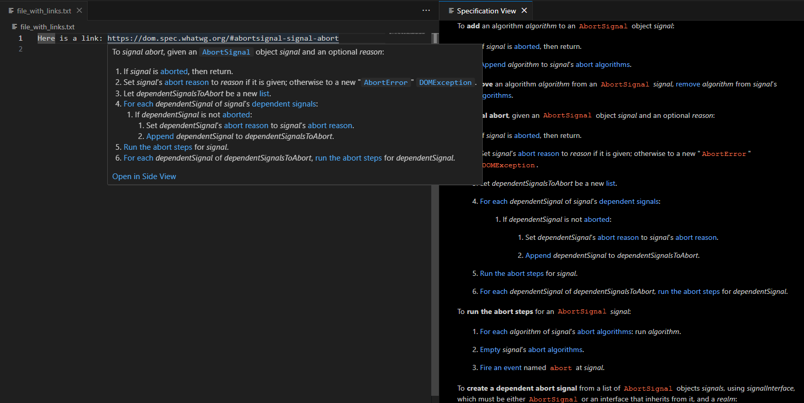

# whatwg-preview

Provides previews on hover for links to WHATWG specifications.

## Features

- Hover over a link to a WHATWG specification to see a preview of the specification.
- Open the specification in a vscode webview from the link preview.
- Accessed specifications are cached in-memory to reduce load times.



## Extension Settings

None

## Release Notes

### 0.0.2

- Fixed missing `jsdom` dependency
- Move "Open in Webview" button to the top of the preview

### 0.0.1

- Initial release

## Development

- The [esbuild Problem Matchers](https://marketplace.visualstudio.com/items?itemName=connor4312.esbuild-problem-matchers) vscode extension is required. Otherwise, this error will occur:
    ```
    Error: Invalid problemMatcher reference: $esbuild-watch
    ```
- For `jsdom` to be bundled, edit `jsdom/lib/jsdom/living/xhr/XMLHttpRequest-impl.js` and replace
  `const syncWorkerFile = require.resolve ? require.resolve("./xhr-sync-worker.js") : null;`
  with
  `const syncWorkerFile = null;`